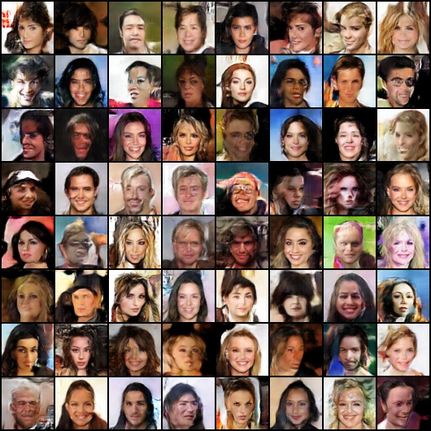

# Usage

First, download the aligned face images from [google](https://drive.google.com/open?id=0B7EVK8r0v71pWEZsZE9oNnFzTm8) or [baidu](https://pan.baidu.com/s/1eSNpdRG#list/path=%2F) to a `data` folder.

Please place dataset 'img_align_celeba.zip' under 'data/celebA/' by default.

Your directory structure should look like this:

```
ch04/
    └── README.md
    └── data
          └── celebA
            └── img_align_celeba
                └── xxxx.jpg
                └── ......

```

Second, train the GAN:

    $ python dcgan_faces_tutorial.py # code copy from https://github.com/pytorch/tutorials/blob/master/beginner_source/dcgan_faces_tutorial.py

# LOG
```
Random Seed:  999
[2023-2-2 17:45:42] [CNNL] [Warning]:[cnnlClip] is deprecated and will be removed in the future release, please use [cnnlClip_v2] instead.
/torch/venv3/pytorch/lib/python3.7/site-packages/torch/nn/modules/module.py:850: UserWarning:  MLU operators don't support 64-bit calculation. so the 64 bit data will be forcibly converted to 32-bit for calculation.  (Triggered internally at  /torch/catch/torch_mlu/csrc/aten/util/tensor_util.cpp:153.)
  return t.to(device, dtype if t.is_floating_point() or t.is_complex() else None, non_blocking)
Generator(
  (main): Sequential(
    (0): ConvTranspose2d(100, 512, kernel_size=(4, 4), stride=(1, 1), bias=False)
    (1): BatchNorm2d(512, eps=1e-05, momentum=0.1, affine=True, track_running_stats=True)
    (2): ReLU(inplace=True)
    (3): ConvTranspose2d(512, 256, kernel_size=(4, 4), stride=(2, 2), padding=(1, 1), bias=False)
    (4): BatchNorm2d(256, eps=1e-05, momentum=0.1, affine=True, track_running_stats=True)
    (5): ReLU(inplace=True)
    (6): ConvTranspose2d(256, 128, kernel_size=(4, 4), stride=(2, 2), padding=(1, 1), bias=False)
    (7): BatchNorm2d(128, eps=1e-05, momentum=0.1, affine=True, track_running_stats=True)
    (8): ReLU(inplace=True)
    (9): ConvTranspose2d(128, 64, kernel_size=(4, 4), stride=(2, 2), padding=(1, 1), bias=False)
    (10): BatchNorm2d(64, eps=1e-05, momentum=0.1, affine=True, track_running_stats=True)
    (11): ReLU(inplace=True)
    (12): ConvTranspose2d(64, 3, kernel_size=(4, 4), stride=(2, 2), padding=(1, 1), bias=False)
    (13): Tanh()
  )
)
Discriminator(
  (main): Sequential(
    (0): Conv2d(3, 64, kernel_size=(4, 4), stride=(2, 2), padding=(1, 1), bias=False)
    (1): LeakyReLU(negative_slope=0.2, inplace=True)
    (2): Conv2d(64, 128, kernel_size=(4, 4), stride=(2, 2), padding=(1, 1), bias=False)
    (3): BatchNorm2d(128, eps=1e-05, momentum=0.1, affine=True, track_running_stats=True)
    (4): LeakyReLU(negative_slope=0.2, inplace=True)
    (5): Conv2d(128, 256, kernel_size=(4, 4), stride=(2, 2), padding=(1, 1), bias=False)
    (6): BatchNorm2d(256, eps=1e-05, momentum=0.1, affine=True, track_running_stats=True)
    (7): LeakyReLU(negative_slope=0.2, inplace=True)
    (8): Conv2d(256, 512, kernel_size=(4, 4), stride=(2, 2), padding=(1, 1), bias=False)
    (9): BatchNorm2d(512, eps=1e-05, momentum=0.1, affine=True, track_running_stats=True)
    (10): LeakyReLU(negative_slope=0.2, inplace=True)
    (11): Conv2d(512, 1, kernel_size=(4, 4), stride=(1, 1), bias=False)
    (12): Sigmoid()
  )
)
Starting Training Loop...
[0/5][0/1583]   Loss_D: 1.5285  Loss_G: 5.8631  D(x): 0.6258    D(G(z)): 0.5673 / 0.0043
[0/5][50/1583]  Loss_D: 0.4446  Loss_G: 15.2135 D(x): 0.9293    D(G(z)): 0.2334 / 0.0000
[0/5][100/1583] Loss_D: 0.3458  Loss_G: 6.5380  D(x): 0.9403    D(G(z)): 0.2144 / 0.0027
[0/5][150/1583] Loss_D: 0.5703  Loss_G: 6.1242  D(x): 0.8739    D(G(z)): 0.2899 / 0.0051
[0/5][200/1583] Loss_D: 0.3213  Loss_G: 4.0015  D(x): 0.8600    D(G(z)): 0.0948 / 0.0302
[0/5][250/1583] Loss_D: 0.7127  Loss_G: 4.9974  D(x): 0.8887    D(G(z)): 0.3716 / 0.0112
[0/5][300/1583] Loss_D: 1.0802  Loss_G: 3.6284  D(x): 0.4843    D(G(z)): 0.0141 / 0.0511
[0/5][350/1583] Loss_D: 0.7399  Loss_G: 2.5416  D(x): 0.6223    D(G(z)): 0.0647 / 0.1083
[0/5][400/1583] Loss_D: 0.4612  Loss_G: 6.8182  D(x): 0.7056    D(G(z)): 0.0069 / 0.0062
[0/5][450/1583] Loss_D: 0.6323  Loss_G: 4.1232  D(x): 0.6942    D(G(z)): 0.0761 / 0.0410
[0/5][500/1583] Loss_D: 0.5340  Loss_G: 6.6957  D(x): 0.9366    D(G(z)): 0.3211 / 0.0030
[0/5][550/1583] Loss_D: 0.5236  Loss_G: 4.3674  D(x): 0.7396    D(G(z)): 0.0575 / 0.0262
[0/5][600/1583] Loss_D: 0.7795  Loss_G: 6.5924  D(x): 0.9012    D(G(z)): 0.4043 / 0.0038
[0/5][650/1583] Loss_D: 0.5647  Loss_G: 4.0709  D(x): 0.8069    D(G(z)): 0.2064 / 0.0270
[0/5][700/1583] Loss_D: 0.6022  Loss_G: 3.8010  D(x): 0.7009    D(G(z)): 0.0791 / 0.0469
[0/5][750/1583] Loss_D: 0.6684  Loss_G: 3.6678  D(x): 0.6661    D(G(z)): 0.0449 / 0.0485
[0/5][800/1583] Loss_D: 1.6172  Loss_G: 5.8780  D(x): 0.3326    D(G(z)): 0.0014 / 0.0076
[0/5][850/1583] Loss_D: 0.3782  Loss_G: 4.8651  D(x): 0.9036    D(G(z)): 0.2021 / 0.0135
[0/5][900/1583] Loss_D: 0.5945  Loss_G: 2.8730  D(x): 0.7712    D(G(z)): 0.1925 / 0.0868
[0/5][950/1583] Loss_D: 0.5990  Loss_G: 3.0824  D(x): 0.6964    D(G(z)): 0.1119 / 0.0713
[0/5][1000/1583]        Loss_D: 0.4218  Loss_G: 4.7058  D(x): 0.9112    D(G(z)): 0.2438 / 0.0146
[0/5][1050/1583]        Loss_D: 0.4172  Loss_G: 3.2423  D(x): 0.7861    D(G(z)): 0.1184 / 0.0632
[0/5][1100/1583]        Loss_D: 0.7091  Loss_G: 2.4754  D(x): 0.6401    D(G(z)): 0.0993 / 0.1274
[0/5][1150/1583]        Loss_D: 0.6669  Loss_G: 2.8042  D(x): 0.6552    D(G(z)): 0.0689 / 0.1076
[0/5][1200/1583]        Loss_D: 0.5264  Loss_G: 3.6920  D(x): 0.8142    D(G(z)): 0.2092 / 0.0413
[0/5][1250/1583]        Loss_D: 0.5328  Loss_G: 2.9984  D(x): 0.7222    D(G(z)): 0.1182 / 0.0677
[0/5][1300/1583]        Loss_D: 0.7380  Loss_G: 3.6283  D(x): 0.5744    D(G(z)): 0.0158 / 0.0563
[0/5][1350/1583]        Loss_D: 0.6129  Loss_G: 2.4484  D(x): 0.6611    D(G(z)): 0.0834 / 0.1299
[0/5][1400/1583]        Loss_D: 0.4778  Loss_G: 3.1277  D(x): 0.7363    D(G(z)): 0.0881 / 0.0679
[0/5][1450/1583]        Loss_D: 0.3969  Loss_G: 2.9346  D(x): 0.7778    D(G(z)): 0.0750 / 0.0809
[0/5][1500/1583]        Loss_D: 2.6221  Loss_G: 1.6607  D(x): 0.1502    D(G(z)): 0.0008 / 0.2895
[0/5][1550/1583]        Loss_D: 0.6245  Loss_G: 4.5816  D(x): 0.8231    D(G(z)): 0.2955 / 0.0175
[1/5][0/1583]   Loss_D: 1.2348  Loss_G: 8.0032  D(x): 0.9540    D(G(z)): 0.6188 / 0.0008
[1/5][50/1583]  Loss_D: 0.4020  Loss_G: 2.8257  D(x): 0.7578    D(G(z)): 0.0702 / 0.0879
[1/5][100/1583] Loss_D: 0.5185  Loss_G: 2.4527  D(x): 0.7662    D(G(z)): 0.1550 / 0.1243
[1/5][150/1583] Loss_D: 0.3766  Loss_G: 3.0579  D(x): 0.8377    D(G(z)): 0.1510 / 0.0626
[1/5][200/1583] Loss_D: 0.2798  Loss_G: 2.9635  D(x): 0.8493    D(G(z)): 0.0797 / 0.0796
[1/5][250/1583] Loss_D: 0.5415  Loss_G: 2.4811  D(x): 0.6899    D(G(z)): 0.0675 / 0.1285
[1/5][300/1583] Loss_D: 1.3410  Loss_G: 6.1945  D(x): 0.9812    D(G(z)): 0.6643 / 0.0056
[1/5][350/1583] Loss_D: 0.4808  Loss_G: 3.0782  D(x): 0.7338    D(G(z)): 0.0980 / 0.0678
[1/5][400/1583] Loss_D: 0.6847  Loss_G: 5.3451  D(x): 0.9205    D(G(z)): 0.4067 / 0.0076
[1/5][450/1583] Loss_D: 0.2809  Loss_G: 3.3767  D(x): 0.8747    D(G(z)): 0.1227 / 0.0461
[1/5][500/1583] Loss_D: 0.7726  Loss_G: 6.3439  D(x): 0.9520    D(G(z)): 0.4591 / 0.0032
[1/5][550/1583] Loss_D: 1.9465  Loss_G: 2.0706  D(x): 0.2218    D(G(z)): 0.0131 / 0.1899
[1/5][600/1583] Loss_D: 0.9141  Loss_G: 6.0470  D(x): 0.9208    D(G(z)): 0.4956 / 0.0043
[1/5][650/1583] Loss_D: 0.4601  Loss_G: 2.5825  D(x): 0.7534    D(G(z)): 0.1128 / 0.1176
[1/5][700/1583] Loss_D: 0.5993  Loss_G: 3.6030  D(x): 0.8963    D(G(z)): 0.3392 / 0.0396
[1/5][750/1583] Loss_D: 0.6066  Loss_G: 2.8370  D(x): 0.7433    D(G(z)): 0.2163 / 0.0849
[1/5][800/1583] Loss_D: 0.5174  Loss_G: 3.2236  D(x): 0.8031    D(G(z)): 0.2088 / 0.0615
[1/5][850/1583] Loss_D: 0.6018  Loss_G: 3.6606  D(x): 0.8670    D(G(z)): 0.3199 / 0.0367
[1/5][900/1583] Loss_D: 0.5257  Loss_G: 3.1029  D(x): 0.8220    D(G(z)): 0.2435 / 0.0588
[1/5][950/1583] Loss_D: 0.4689  Loss_G: 3.3694  D(x): 0.8782    D(G(z)): 0.2417 / 0.0530
[1/5][1000/1583]        Loss_D: 0.3583  Loss_G: 4.1486  D(x): 0.9185    D(G(z)): 0.2167 / 0.0237
[1/5][1050/1583]        Loss_D: 0.3945  Loss_G: 3.0927  D(x): 0.7648    D(G(z)): 0.0848 / 0.0667
[1/5][1100/1583]        Loss_D: 1.6553  Loss_G: 0.8245  D(x): 0.2835    D(G(z)): 0.0153 / 0.5301
[1/5][1150/1583]        Loss_D: 0.6029  Loss_G: 1.6438  D(x): 0.6295    D(G(z)): 0.0636 / 0.2617
[1/5][1200/1583]        Loss_D: 0.6601  Loss_G: 2.5849  D(x): 0.6136    D(G(z)): 0.0586 / 0.1146
[1/5][1250/1583]        Loss_D: 0.6915  Loss_G: 4.0223  D(x): 0.8844    D(G(z)): 0.3896 / 0.0274
[1/5][1300/1583]        Loss_D: 0.3473  Loss_G: 2.9691  D(x): 0.8588    D(G(z)): 0.1532 / 0.0694
[1/5][1350/1583]        Loss_D: 0.8951  Loss_G: 3.9167  D(x): 0.8868    D(G(z)): 0.4836 / 0.0326
[1/5][1400/1583]        Loss_D: 0.6529  Loss_G: 3.8013  D(x): 0.8875    D(G(z)): 0.3735 / 0.0315
[1/5][1450/1583]        Loss_D: 0.5069  Loss_G: 2.9131  D(x): 0.7225    D(G(z)): 0.1096 / 0.0785
[1/5][1500/1583]        Loss_D: 0.6100  Loss_G: 1.6266  D(x): 0.7021    D(G(z)): 0.1769 / 0.2496
[1/5][1550/1583]        Loss_D: 1.1382  Loss_G: 0.8321  D(x): 0.4644    D(G(z)): 0.1578 / 0.4917
[2/5][0/1583]   Loss_D: 0.4433  Loss_G: 3.4221  D(x): 0.8394    D(G(z)): 0.2099 / 0.0455
[2/5][50/1583]  Loss_D: 0.4918  Loss_G: 2.8661  D(x): 0.8420    D(G(z)): 0.2460 / 0.0733
[2/5][100/1583] Loss_D: 0.4320  Loss_G: 2.9439  D(x): 0.7935    D(G(z)): 0.1392 / 0.0766
[2/5][150/1583] Loss_D: 1.1881  Loss_G: 5.8407  D(x): 0.9280    D(G(z)): 0.6152 / 0.0048
[2/5][200/1583] Loss_D: 0.6419  Loss_G: 3.1733  D(x): 0.8435    D(G(z)): 0.3378 / 0.0570
[2/5][250/1583] Loss_D: 0.7452  Loss_G: 1.9175  D(x): 0.6278    D(G(z)): 0.1608 / 0.1924
[2/5][300/1583] Loss_D: 0.5165  Loss_G: 2.7480  D(x): 0.8531    D(G(z)): 0.2658 / 0.0820
[2/5][350/1583] Loss_D: 1.0223  Loss_G: 0.8293  D(x): 0.4329    D(G(z)): 0.0475 / 0.4792
[2/5][400/1583] Loss_D: 1.6419  Loss_G: 6.5303  D(x): 0.9677    D(G(z)): 0.7384 / 0.0032
[2/5][450/1583] Loss_D: 0.8299  Loss_G: 1.5270  D(x): 0.6160    D(G(z)): 0.2265 / 0.2547
[2/5][500/1583] Loss_D: 0.3789  Loss_G: 3.4416  D(x): 0.8116    D(G(z)): 0.1286 / 0.0447
[2/5][550/1583] Loss_D: 0.5284  Loss_G: 3.4209  D(x): 0.8770    D(G(z)): 0.2963 / 0.0445
[2/5][600/1583] Loss_D: 0.6036  Loss_G: 1.8272  D(x): 0.6605    D(G(z)): 0.1243 / 0.2006
[2/5][650/1583] Loss_D: 0.8654  Loss_G: 1.1859  D(x): 0.5470    D(G(z)): 0.1459 / 0.3684
[2/5][700/1583] Loss_D: 0.5529  Loss_G: 2.1824  D(x): 0.7815    D(G(z)): 0.2344 / 0.1400
[2/5][750/1583] Loss_D: 0.7831  Loss_G: 3.9905  D(x): 0.9114    D(G(z)): 0.4489 / 0.0279
[2/5][800/1583] Loss_D: 0.6957  Loss_G: 3.4023  D(x): 0.8942    D(G(z)): 0.4022 / 0.0450
[2/5][850/1583] Loss_D: 0.5327  Loss_G: 2.8662  D(x): 0.8090    D(G(z)): 0.2453 / 0.0736
[2/5][900/1583] Loss_D: 0.7083  Loss_G: 3.5360  D(x): 0.9509    D(G(z)): 0.4327 / 0.0411
[2/5][950/1583] Loss_D: 0.5891  Loss_G: 1.5730  D(x): 0.6461    D(G(z)): 0.0929 / 0.2449
[2/5][1000/1583]        Loss_D: 0.8377  Loss_G: 1.3616  D(x): 0.5246    D(G(z)): 0.0792 / 0.3064
[2/5][1050/1583]        Loss_D: 1.5396  Loss_G: 0.5996  D(x): 0.2972    D(G(z)): 0.0215 / 0.5983
[2/5][1100/1583]        Loss_D: 0.6891  Loss_G: 3.6968  D(x): 0.9433    D(G(z)): 0.4283 / 0.0365
[2/5][1150/1583]        Loss_D: 0.8524  Loss_G: 4.4210  D(x): 0.9262    D(G(z)): 0.4939 / 0.0175
[2/5][1200/1583]        Loss_D: 0.7707  Loss_G: 4.8833  D(x): 0.9302    D(G(z)): 0.4623 / 0.0122
[2/5][1250/1583]        Loss_D: 0.5673  Loss_G: 3.3581  D(x): 0.8950    D(G(z)): 0.3255 / 0.0455
[2/5][1300/1583]        Loss_D: 0.4136  Loss_G: 2.9239  D(x): 0.7811    D(G(z)): 0.1268 / 0.0755
[2/5][1350/1583]        Loss_D: 0.8908  Loss_G: 3.1807  D(x): 0.8246    D(G(z)): 0.4506 / 0.0595
[2/5][1400/1583]        Loss_D: 1.2207  Loss_G: 4.8162  D(x): 0.8168    D(G(z)): 0.5627 / 0.0127
[2/5][1450/1583]        Loss_D: 0.8844  Loss_G: 4.3304  D(x): 0.9323    D(G(z)): 0.4989 / 0.0192
[2/5][1500/1583]        Loss_D: 0.7650  Loss_G: 2.6757  D(x): 0.8105    D(G(z)): 0.3834 / 0.0932
[2/5][1550/1583]        Loss_D: 0.5128  Loss_G: 1.9203  D(x): 0.7370    D(G(z)): 0.1578 / 0.1780
[3/5][0/1583]   Loss_D: 0.6103  Loss_G: 2.7366  D(x): 0.7722    D(G(z)): 0.2565 / 0.0870
[3/5][50/1583]  Loss_D: 0.7857  Loss_G: 2.3228  D(x): 0.6911    D(G(z)): 0.2881 / 0.1238
[3/5][100/1583] Loss_D: 0.6808  Loss_G: 4.0779  D(x): 0.8892    D(G(z)): 0.3969 / 0.0228
[3/5][150/1583] Loss_D: 0.5636  Loss_G: 2.8062  D(x): 0.8348    D(G(z)): 0.2879 / 0.0781
[3/5][200/1583] Loss_D: 1.0781  Loss_G: 0.8013  D(x): 0.4265    D(G(z)): 0.0754 / 0.4955
[3/5][250/1583] Loss_D: 0.4494  Loss_G: 3.3445  D(x): 0.9234    D(G(z)): 0.2848 / 0.0454
[3/5][300/1583] Loss_D: 0.8075  Loss_G: 4.1984  D(x): 0.9013    D(G(z)): 0.4600 / 0.0195
[3/5][350/1583] Loss_D: 0.5937  Loss_G: 2.0602  D(x): 0.8432    D(G(z)): 0.3103 / 0.1572
[3/5][400/1583] Loss_D: 0.5381  Loss_G: 2.5443  D(x): 0.7387    D(G(z)): 0.1703 / 0.1027
[3/5][450/1583] Loss_D: 0.4824  Loss_G: 2.7013  D(x): 0.7721    D(G(z)): 0.1753 / 0.0829
[3/5][500/1583] Loss_D: 1.1566  Loss_G: 0.9449  D(x): 0.3999    D(G(z)): 0.0672 / 0.4695
[3/5][550/1583] Loss_D: 0.6788  Loss_G: 2.7317  D(x): 0.8500    D(G(z)): 0.3671 / 0.0844
[3/5][600/1583] Loss_D: 0.5454  Loss_G: 2.3931  D(x): 0.7520    D(G(z)): 0.1949 / 0.1171
[3/5][650/1583] Loss_D: 0.5142  Loss_G: 2.2035  D(x): 0.7953    D(G(z)): 0.2185 / 0.1349
[3/5][700/1583] Loss_D: 0.4861  Loss_G: 2.3705  D(x): 0.7742    D(G(z)): 0.1805 / 0.1128
[3/5][750/1583] Loss_D: 0.5423  Loss_G: 2.4719  D(x): 0.8285    D(G(z)): 0.2712 / 0.1066
[3/5][800/1583] Loss_D: 0.8372  Loss_G: 4.0984  D(x): 0.9296    D(G(z)): 0.4887 / 0.0235
[3/5][850/1583] Loss_D: 0.7111  Loss_G: 2.2947  D(x): 0.7204    D(G(z)): 0.2699 / 0.1271
[3/5][900/1583] Loss_D: 0.7833  Loss_G: 1.4806  D(x): 0.6379    D(G(z)): 0.2295 / 0.2665
[3/5][950/1583] Loss_D: 0.5553  Loss_G: 1.8477  D(x): 0.6942    D(G(z)): 0.1240 / 0.1998
[3/5][1000/1583]        Loss_D: 0.6793  Loss_G: 1.4313  D(x): 0.6069    D(G(z)): 0.1128 / 0.2824
[3/5][1050/1583]        Loss_D: 0.7238  Loss_G: 1.5841  D(x): 0.6679    D(G(z)): 0.2154 / 0.2455
[3/5][1100/1583]        Loss_D: 0.6550  Loss_G: 1.6535  D(x): 0.6562    D(G(z)): 0.1601 / 0.2273
[3/5][1150/1583]        Loss_D: 0.7755  Loss_G: 1.3063  D(x): 0.5619    D(G(z)): 0.1087 / 0.3205
[3/5][1200/1583]        Loss_D: 0.8691  Loss_G: 1.6822  D(x): 0.6766    D(G(z)): 0.3242 / 0.2201
[3/5][1250/1583]        Loss_D: 0.5345  Loss_G: 1.8976  D(x): 0.6893    D(G(z)): 0.1166 / 0.1947
[3/5][1300/1583]        Loss_D: 0.5816  Loss_G: 1.6937  D(x): 0.6683    D(G(z)): 0.1180 / 0.2246
[3/5][1350/1583]        Loss_D: 0.5373  Loss_G: 1.6739  D(x): 0.6739    D(G(z)): 0.0897 / 0.2200
[3/5][1400/1583]        Loss_D: 0.6510  Loss_G: 1.9442  D(x): 0.6666    D(G(z)): 0.1710 / 0.1743
[3/5][1450/1583]        Loss_D: 0.6662  Loss_G: 1.2340  D(x): 0.6349    D(G(z)): 0.1497 / 0.3253
[3/5][1500/1583]        Loss_D: 1.8164  Loss_G: 5.1818  D(x): 0.9618    D(G(z)): 0.7666 / 0.0101
[3/5][1550/1583]        Loss_D: 0.7566  Loss_G: 3.9309  D(x): 0.9032    D(G(z)): 0.4417 / 0.0255
[4/5][0/1583]   Loss_D: 0.9512  Loss_G: 1.1587  D(x): 0.5012    D(G(z)): 0.0995 / 0.3717
[4/5][50/1583]  Loss_D: 2.2522  Loss_G: 0.1804  D(x): 0.1591    D(G(z)): 0.0125 / 0.8459
[4/5][100/1583] Loss_D: 0.8359  Loss_G: 1.5104  D(x): 0.5216    D(G(z)): 0.0671 / 0.2691
[4/5][150/1583] Loss_D: 0.5137  Loss_G: 2.6689  D(x): 0.8409    D(G(z)): 0.2629 / 0.0872
[4/5][200/1583] Loss_D: 0.6929  Loss_G: 2.8340  D(x): 0.8585    D(G(z)): 0.3794 / 0.0748
[4/5][250/1583] Loss_D: 0.6116  Loss_G: 3.1710  D(x): 0.8574    D(G(z)): 0.3393 / 0.0553
[4/5][300/1583] Loss_D: 0.5570  Loss_G: 1.9653  D(x): 0.7161    D(G(z)): 0.1575 / 0.1714
[4/5][350/1583] Loss_D: 1.5747  Loss_G: 5.0045  D(x): 0.9792    D(G(z)): 0.7339 / 0.0110
[4/5][400/1583] Loss_D: 0.5607  Loss_G: 2.0911  D(x): 0.7338    D(G(z)): 0.1826 / 0.1580
[4/5][450/1583] Loss_D: 0.3843  Loss_G: 2.7958  D(x): 0.8475    D(G(z)): 0.1776 / 0.0779
[4/5][500/1583] Loss_D: 0.9811  Loss_G: 2.2874  D(x): 0.6617    D(G(z)): 0.3376 / 0.1323
[4/5][550/1583] Loss_D: 0.8207  Loss_G: 1.1824  D(x): 0.5115    D(G(z)): 0.0377 / 0.3527
[4/5][600/1583] Loss_D: 2.4577  Loss_G: 0.2296  D(x): 0.1450    D(G(z)): 0.0348 / 0.8322
[4/5][650/1583] Loss_D: 0.6865  Loss_G: 3.4337  D(x): 0.8635    D(G(z)): 0.3755 / 0.0427
[4/5][700/1583] Loss_D: 0.6227  Loss_G: 3.3290  D(x): 0.8645    D(G(z)): 0.3435 / 0.0504
[4/5][750/1583] Loss_D: 0.5071  Loss_G: 1.7544  D(x): 0.7303    D(G(z)): 0.1392 / 0.2127
[4/5][800/1583] Loss_D: 0.6338  Loss_G: 2.2092  D(x): 0.7907    D(G(z)): 0.2913 / 0.1358
[4/5][850/1583] Loss_D: 1.1085  Loss_G: 0.9410  D(x): 0.4103    D(G(z)): 0.0749 / 0.4383
[4/5][900/1583] Loss_D: 0.8128  Loss_G: 1.4282  D(x): 0.5377    D(G(z)): 0.0623 / 0.2866
[4/5][950/1583] Loss_D: 0.4961  Loss_G: 2.5470  D(x): 0.8516    D(G(z)): 0.2533 / 0.1012
[4/5][1000/1583]        Loss_D: 0.7976  Loss_G: 3.5408  D(x): 0.8736    D(G(z)): 0.4369 / 0.0410
[4/5][1050/1583]        Loss_D: 0.4386  Loss_G: 2.2571  D(x): 0.7705    D(G(z)): 0.1375 / 0.1356
[4/5][1100/1583]        Loss_D: 0.8175  Loss_G: 2.0464  D(x): 0.5496    D(G(z)): 0.1090 / 0.1813
[4/5][1150/1583]        Loss_D: 0.6417  Loss_G: 2.9518  D(x): 0.8176    D(G(z)): 0.3174 / 0.0651
[4/5][1200/1583]        Loss_D: 0.6308  Loss_G: 1.7310  D(x): 0.6381    D(G(z)): 0.1046 / 0.2211
[4/5][1250/1583]        Loss_D: 0.4895  Loss_G: 2.0795  D(x): 0.7906    D(G(z)): 0.2015 / 0.1516
[4/5][1300/1583]        Loss_D: 0.4171  Loss_G: 2.9812  D(x): 0.8463    D(G(z)): 0.1953 / 0.0656
[4/5][1350/1583]        Loss_D: 0.4804  Loss_G: 2.2316  D(x): 0.7714    D(G(z)): 0.1662 / 0.1317
[4/5][1400/1583]        Loss_D: 0.6915  Loss_G: 2.6986  D(x): 0.7657    D(G(z)): 0.3007 / 0.0915
[4/5][1450/1583]        Loss_D: 0.7092  Loss_G: 3.1041  D(x): 0.8607    D(G(z)): 0.3906 / 0.0595
[4/5][1500/1583]        Loss_D: 0.7728  Loss_G: 1.9197  D(x): 0.6410    D(G(z)): 0.2216 / 0.1764
[4/5][1550/1583]        Loss_D: 0.5734  Loss_G: 1.5662  D(x): 0.6571    D(G(z)): 0.1024 / 0.2523
```


# 训练效果
 